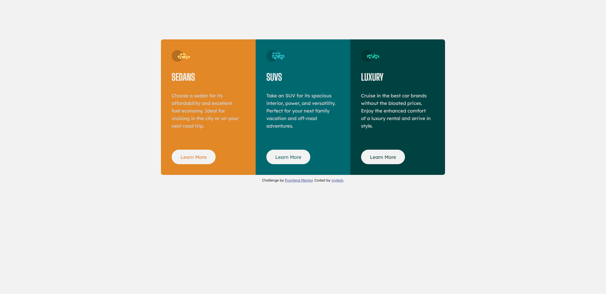

# Frontend Mentor - 3-column preview card component solution

This is a solution to the [3-column preview card component challenge on Frontend Mentor](https://www.frontendmentor.io/challenges/3column-preview-card-component-pH92eAR2-). Frontend Mentor challenges help you improve your coding skills by building realistic projects. 

## Table of contents

- [Overview](#overview)
  - [The challenge](#the-challenge)
  - [Screenshot](#screenshot)
  - [Links](#links)
- [My process](#my-process)
  - [Built with](#built-with)
  - [What I learned](#what-i-learned)
  - [Continued development](#continued-development)
  - [Useful resources](#useful-resources)
- [Author](#author)

## Overview

My solution to this Frontend Mentor challenge.

### The challenge

Users should be able to:

- View the optimal layout depending on their device's screen size
- See hover states for interactive elements

### Screenshot



### Links

- Solution URL: [Frontend Mentor](https://www.frontendmentor.io/solutions/3-column-preview-card-component-n5YTbQC_aL)
- Live Site URL: [Netlify](https://three-column-preview-card-comp-myles.netlify.app/)

## My process

- Reviewed the style-guide and mockup images
- Created html and css files, then added root section with style guide elements to CSS file
- Formatted HTML elements using CSS
- Added media query to change flex direction for small screens

### Built with

- Semantic HTML5 markup
- CSS custom properties
- Flexbox

### What I learned

I learned that if you want one flex element to push to an edge, you can do so by adding an auto margin for the opposite end that you want the element to push against. 

At first, I was struggling to figure out how to get the button to always hug the bottom of the column as the screen responds, but was able to do so by adding an auto margin:

```css
.btn {
  margin-top: auto;
}
```
### Useful resources

- [Kevin Powell](https://youtu.be/_-aDOAMmDHI) - Learned the differences between em and rem, plus when to use. It make it easier to simplify my media queries.

## Author

- Frontend Mentor - [@mylesh-portfolio](https://www.frontendmentor.io/profile/myles-portfolio)
- Medium - [@mylesh_](https://medium.com/@mylesh_)
