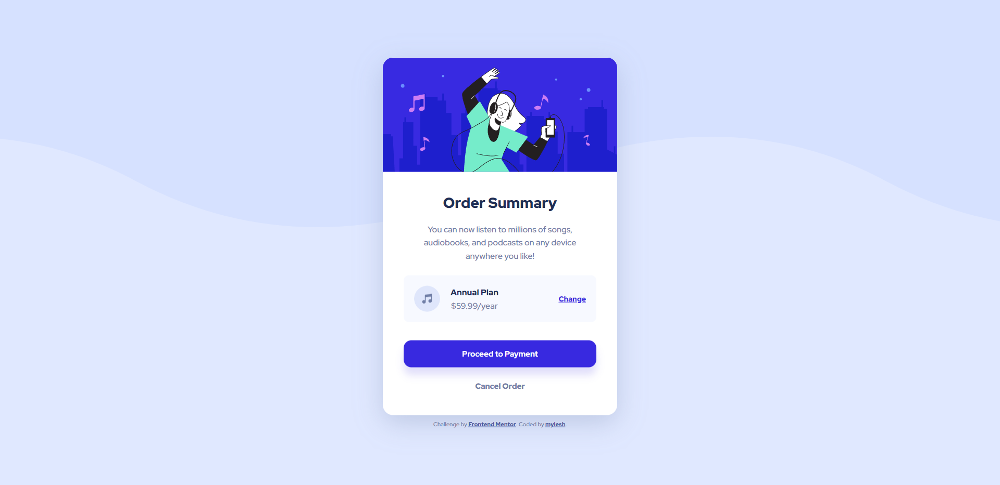

# Frontend Mentor - Order summary card solution

This is a solution to the [Order summary card challenge on Frontend Mentor](https://www.frontendmentor.io/challenges/order-summary-component-QlPmajDUj). Frontend Mentor challenges help you improve your coding skills by building realistic projects. 

## Table of contents

- [Overview](#overview)
  - [The challenge](#the-challenge)
  - [Screenshot](#screenshot)
  - [Links](#links)
- [My process](#my-process)
  - [Built with](#built-with)
  - [What I learned](#what-i-learned)
  - [Continued development](#continued-development)
- [Author](#author)

## Overview

This is my 5th component project completed from Frontend Mentor.

### The challenge

Users should be able to:

- See hover states for interactive elements

### Screenshot

### Links

- Solution URL: [Frontend Mentor](https://www.frontendmentor.io/solutions/order-summary-component-drlqlBnA38)
- Live Site URL: [Netlify](https://order-summary-component-myles.netlify.app/)

## My process

- Reviewed the style-guide and mockup images
- Created html and css files, then added root section with style guide elements to CSS file
- Formatted HTML using Flexbox
- Filled in default and standardized CSS attributes to img, h2, and p elements
- Worked on image overlay for interactive image
- Launched page and begin adjusting margin, padding and border until I was happy with the look for the desktop view
- Repeated last step for mobile view and wrapped up with tweaks to the scale of the container on widths between media screens

### Built with

- Semantic HTML5 markup
- CSS custom properties
- Flexbox
- CSS Grid

### What I learned

I learned more about positioning background during this project. I'd like to spend more time mastering positioning and the background shorthand to consolidate lines of code.

### Continued development

See above.

## Author

- Frontend Mentor - [@mylesh-portfolio](https://www.frontendmentor.io/profile/myles-portfolio)
- Medium - [@mylesh_](https://medium.com/@mylesh_)