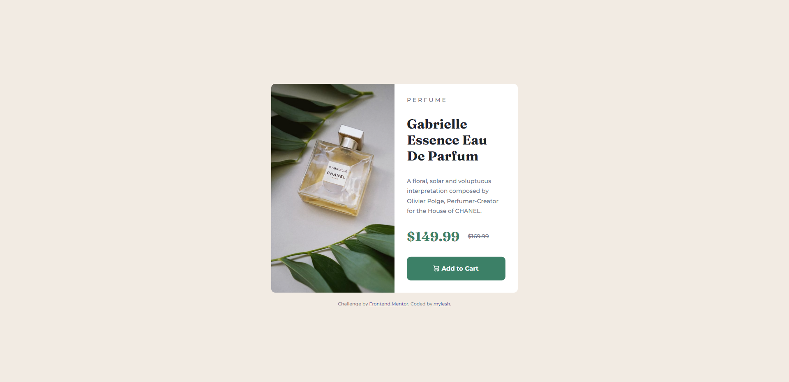

# Frontend Mentor - Product preview card component solution

This is a solution to the [Product preview card component challenge on Frontend Mentor](https://www.frontendmentor.io/challenges/product-preview-card-component-GO7UmttRfa). Frontend Mentor challenges help you improve your coding skills by building realistic projects. 

## Table of contents

- [Overview](#overview)
  - [The challenge](#the-challenge)
  - [Screenshot](#screenshot)
  - [Links](#links)
- [My process](#my-process)
  - [Built with](#built-with)
  - [What I learned](#what-i-learned)
  - [Continued development](#continued-development)
- [Author](#author)

## Overview

This is my rendition of the product preview card component challenge from Frontend Mentor. It's based solely on my interpretation of the design as I don't have premium, so I do not have access to the design file.

### The challenge

Users should be able to:

- View the optimal layout depending on their device's screen size
- See hover and focus states for interactive elements

### Screenshot

### Links

- Solution URL: [Frontend Mentor](https://your-solution-url.com)
- Live Site URL: [Netlify](https://prod-preview-card-component-myles.netlify.app/)

## My process

- Reviewed the style-guide and mockup images
- Created html and css files, then added root section with style guide elements
- Added stylesheets for CSS and font to HTML
- Formatted HTML in containers and made notes on if I wanted a container to be flexbox or not
- Filled in default and standardized CSS attributes to elements
- Launched page and begin adjusting margin, padding and border until I was happy with the look for the desktop view
- Repeated last step for mobile view and wrapped up with tweaks to the scale of the container on widths between media screens

### Built with

- Semantic HTML5 markup
- CSS custom properties
- Flexbox

### What I learned

Use this section to recap over some of your major learnings while working through this project. Writing these out and providing code samples of areas you want to highlight is a great way to reinforce your own knowledge.

### Continued development

I want to continue building mastery with CSS Backgrounds.

## Author

- Frontend Mentor - [@mylesh-portfolio](https://www.frontendmentor.io/profile/myles-portfolio)
- Medium - [@mylesh_](https://medium.com/@mylesh_)
