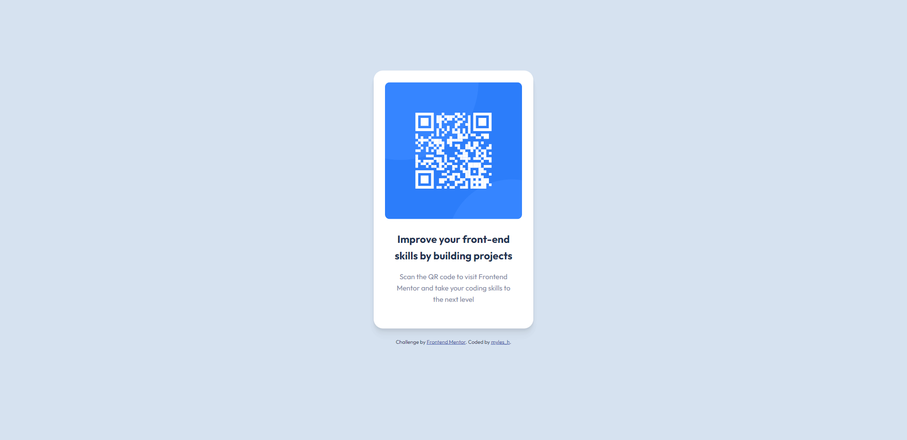

# Frontend Mentor - QR code component solution

This is a solution to the [QR code component challenge on Frontend Mentor](https://www.frontendmentor.io/challenges/qr-code-component-iux_sIO_H). Frontend Mentor challenges help you improve your coding skills by building realistic projects. 

## Table of contents

- [Overview](#overview)
  - [Screenshot](#screenshot)
  - [Links](#links)
- [My process](#my-process)
  - [Built with](#built-with)
  - [What I learned](#what-i-learned)
  - [Continued development](#continued-development)
  - [Useful resources](#useful-resources)
- [Author](#author)

## Overview

This is my first submission for Frontend Mentor. I really enjoy the process and opportunity to practice my HTML/CSS skills. I look forward to continue with future challenges.

### Screenshot



### Links

- Solution URL: [Frontend Mentor](https://www.frontendmentor.io/solutions/qr-code-component-using-html-and-css-f-ywIRutPu) 
- Live Site URL: [Netlify](https://qrcode-challenge-1.netlify.app/) 

## My process

- Reviewed the style-guide and mockup images
- Created html and css files, then added root section with style guide elements
- Added stylesheets for CSS and font to HTML
- Formatted HTML in containers and made notes on if I wanted a container to be flexbox or not
- Filled in default and standardized CSS attributes to img, h2, and p elements
- Launched page and begin adjusting margin, padding and border until I was happy with the look for the desktop view
- Repeated last step for mobile view and wrapped up with tweaks to the scale of the container on widths between media screens

### Built with

- HTML5
- CSS 
- Flexbox

### What I learned

I learned that there are ways to create more dynamic box shadows for a specific look via layering. I also found a box shadow generator tool online to speed up the process of creating box shadows that I like. I can use these set shadows to create a box shadow component library with common names for me to grab and use quickly as needed.

```html
<h1>Some CSS code I'm proud of</h1>
```
```css
.qrc-card {
  box-shadow: 
    0 1.5px 2.4px rgba(0, 0, 0, 0.04),
    0 5px 3.5px rgba(0, 0, 0, 0.032),
    0 9.5px 5.5px rgba(0, 0, 0, 0.025),
    0 13.2px 9.5px rgba(0, 0, 0, 0.018),
    0 15.6px 16.3px rgba(0, 0, 0, 0.013),
    0 17px 26px rgba(0, 0, 0, 0.007);
  }
```

### Continued development

I want to continue working on responsiveness between screen sizes. It took me 30 minutes to make the elements look nice in their container when collapsing the browser.

### Useful resources

- [Neumorphism.io](https://neumorphism.io/) - This helped me create a nice looking box shadow for the card the QR code is located in.
## Author

- Frontend Mentor - [@mylesh-portfolio](https://www.frontendmentor.io/profile/myles-portfolio)
- Medium - [@mylesh_](https://medium.com/@mylesh_)

