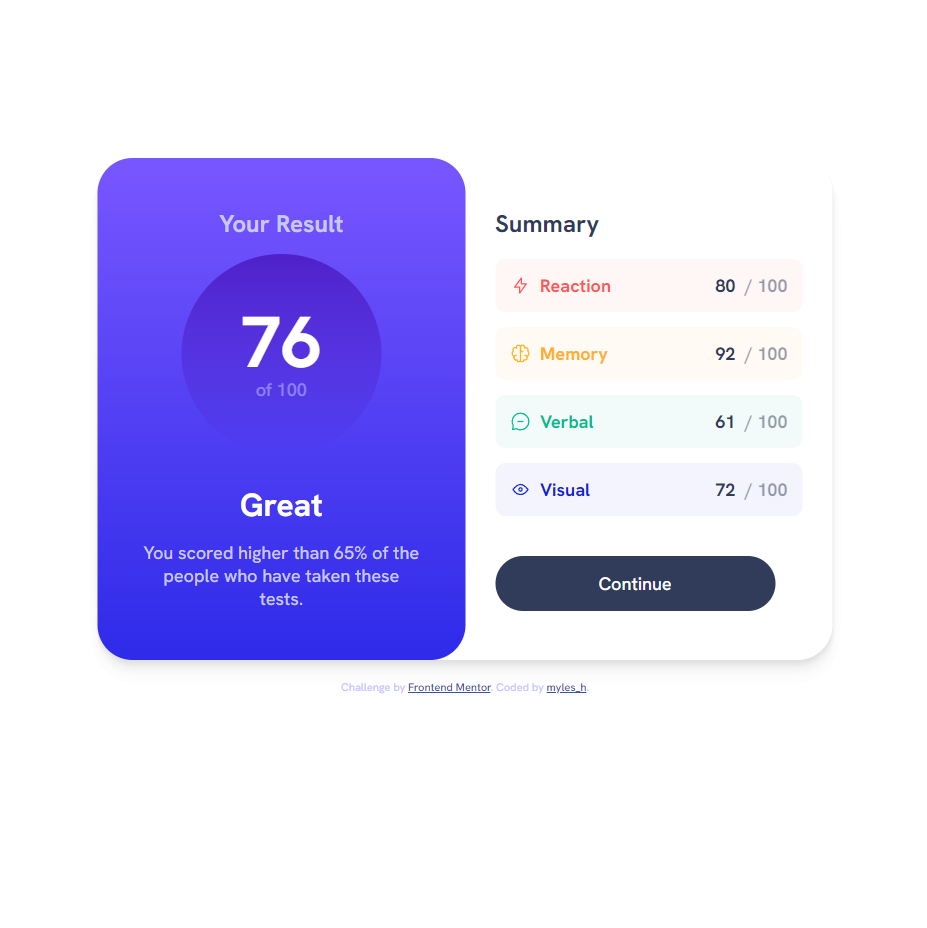

# Frontend Mentor - Results summary component solution

This is a solution to the [Results summary component challenge on Frontend Mentor](https://www.frontendmentor.io/challenges/results-summary-component-CE_K6s0maV). Frontend Mentor challenges help you improve your coding skills by building realistic projects. 

## Table of contents

- [Overview](#overview)
  - [The challenge](#the-challenge)
  - [Screenshot](#screenshot)
  - [Links](#links)
- [My process](#my-process)
  - [Built with](#built-with)
  - [What I learned](#what-i-learned)
- [Author](#author)

## Overview

I completed my second ever Frontend Mentor Challenge where I built a results summary component.
### The challenge

Users should be able to:

- View the optimal layout for the interface depending on their device's screen size
- See hover and focus states for all interactive elements on the page

### Screenshot



### Links

- Solution URL: [Add solution URL here](https://your-solution-url.com)
- Live Site URL: [Add live site URL here](https://your-live-site-url.com)

## My process

### Built with

- Semantic HTML5 markup
- CSS custom properties
- Flexbox
- CSS Grid

### What I learned

I learned that changing the opacity on an element would change it for all contained items of that element. I had to think about how to make the background of the summary results lighter to be similar to the mockup. I ended up doing this by using the before pseudo class.


```html
<h1>Some HTML code I'm proud of</h1>
```
```css
#first:before,
#second:before,
#third:before,
#fourth:before {
  content: '';
  position: absolute;
  border-radius: 10px;
  left: 0;
  top: 0;
  width: 100%;
  height: 100%;
  opacity: 5%;
}

#first:before {
  background-color: var(--red);
}

#second:before {
  background-color: var(--yellow);
}

#third:before {
  background-color: var(--green);
}

#fourth:before {
  background-color: var(--blue);
}
```
## Author

- Frontend Mentor - [@mylesh-portfolio](https://www.frontendmentor.io/profile/myles-portfolio)
- Medium - [@mylesh_](https://medium.com/@mylesh_)


