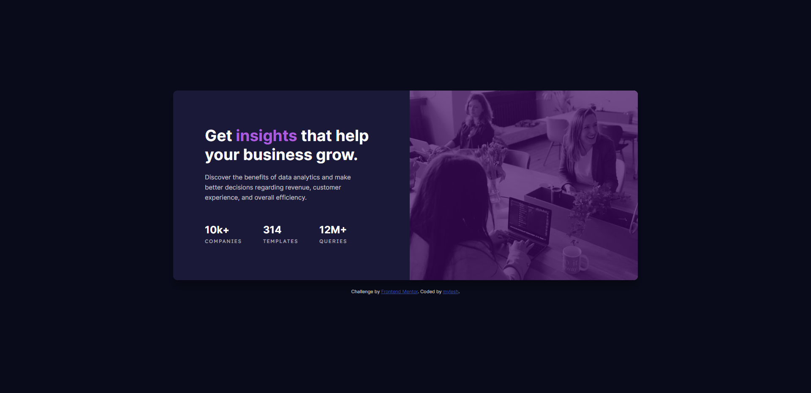

# Frontend Mentor - Stats preview card component solution

This is a solution to the [Stats preview card component challenge on Frontend Mentor](https://www.frontendmentor.io/challenges/stats-preview-card-component-8JqbgoU62). Frontend Mentor challenges help you improve your coding skills by building realistic projects. 

## Table of contents

- [Overview](#overview)
  - [The challenge](#the-challenge)
  - [Screenshot](#screenshot)
  - [Links](#links)
- [My process](#my-process)
  - [Built with](#built-with)
  - [What I learned](#what-i-learned)
- [Author](#author)

## Overview

My solution to the Stats preview card without access to the design doc.

### The challenge

Users should be able to:

- View the optimal layout depending on their device's screen size

### Screenshot

### Links

- Solution URL: [Frontend Mentor](https://your-solution-url.com)
- Live Site URL: [Netlify](https://stats-preview-card-component-myles.netlify.app/)

## My process

- Reviewed the style-guide and mockup images
- Created html and css files, then added root section with style guide elements to CSS file
- Formatted HTML using Flexbox
- Filled in default and standardized CSS attributes to img, h2, and p elements
- Worked on image overlay for interactive image
- Launched page and begin adjusting margin, padding and border until I was happy with the look for the desktop view
- Repeated last step for mobile view and wrapped up with tweaks to the scale of the container on widths between media screens

I would note for this one that the font sizing took me some time, I need to not be such a stickler for pixel perfect mockup matches, especially when I do not have access to the design doc. As long as it looks close enough to the mockup, the stakeholder would ultimately be happy with the result.

### Built with

- Semantic HTML5 markup
- CSS custom properties
- Flexbox

### What I learned

I learned that while I am not an expert at CSS, I am still retaining what I'm learning through practice. I was able to set up the image overlay without referring to an external resource (win)!

## Author

- Frontend Mentor - [@mylesh-portfolio](https://www.frontendmentor.io/profile/myles-portfolio)
- Medium - [@mylesh_](https://medium.com/@mylesh_)