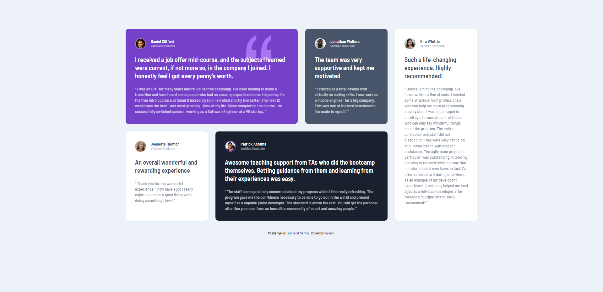

# Frontend Mentor - Testimonials grid section solution

This is a solution to the [Testimonials grid section challenge on Frontend Mentor](https://www.frontendmentor.io/challenges/testimonials-grid-section-Nnw6J7Un7). Frontend Mentor challenges help you improve your coding skills by building realistic projects. 

## Table of contents

- [Overview](#overview)
  - [The challenge](#the-challenge)
  - [Screenshot](#screenshot)
  - [Links](#links)
- [My process](#my-process)
  - [Built with](#built-with)
  - [What I learned](#what-i-learned)
  - [Continued development](#continued-development)
  - [Useful resources](#useful-resources)
- [Author](#author)

## Overview

My solution to this Frontend Mentor challenge.

### The challenge

Users should be able to:

- View the optimal layout for the site depending on their device's screen size

### Screenshot



### Links

- Solution URL: [Frontend Mentor](https://your-solution-url.com)
- Live Site URL: [Netlify](https://testinomials-grid-section-myles.netlify.app/)

## My process

- Reviewed the style-guide and mockup images
- Created html and css files, then added root section with style guide elements to CSS file
- Formatted HTML elements using CSS
- Initiated CSS Grid layout
- Set up different grid layout for varying media screens
- Tried figuring out how to get the icon to appear behind the text of the first testimonial, but was unsuccessful.

### Built with

- Semantic HTML5 markup
- CSS custom properties
- Flexbox
- CSS Grid

### What I learned

I got to practice my CSS grid skills and understand to appreciate grid-template-area for it's ease of use. I also got a chance to practice using the nth-child pseudo class instead of unique class names for the different grid items.

```css
.testimonialCard:nth-child(1) .image {
  border: 2px solid hsla(0, 0%, 100%, 0.3);
}

.testimonialCard:nth-child(4) .image {
  border: 2px solid var(--moderate-violet);
}
```

### Continued development

I want to practice using CSS grid more, and will likely find additional projects where I can practice it.

I still need to figure out how to get the quotation icon SVG to appear behind the text of the first testimonial.


### Useful resources

- [Kevin Powell](https://youtu.be/rg7Fvvl3taU) - This help me see how easy CSS grid actually is, as well as how to change the layout on different media screens.

## Author

- Frontend Mentor - [@mylesh-portfolio](https://www.frontendmentor.io/profile/myles-portfolio)
- Medium - [@mylesh_](https://medium.com/@mylesh_)